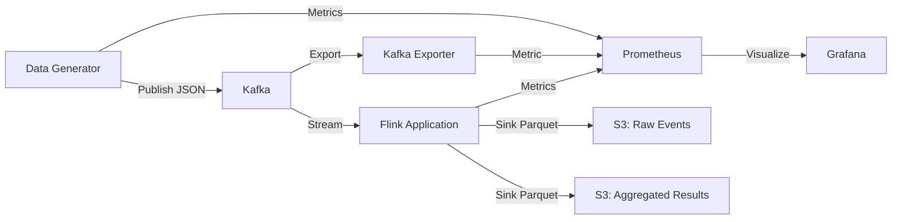

# Real-Time Pageview Data Pipeline

A real-time data pipeline for processing website pageview events using Kafka and Apache Flink, deployed locally via Docker and LocalStack (S3)

## Architecture



## Project Structure

```bash
├── flink-app/                  # PyFlink Stream Processing Logic
│   ├── src/
│   │   ├── sql/                # SQL Definition Package
│   │   │   ├── tables.py       # SQL DDL: Sources & Sinks (Kafka, S3)
│   │   │   ├── views.py        # SQL Views: Deduplication & Validation Logic
│   │   │   └── inserts.py      # SQL DML: Pipeline Connectivity
│   │   ├── config.py           # Flink Job Configuration (Env Vars)
│   │   └── main.py             # App Entrypoint: Job Graph Orchestration
│   └── tests/                  # Flink SQL & Integration Tests
│
├── src/                        # Python Support Modules
│   ├── common/                 # Shared Utilities (Schemas, Logging)
│   └── data_generator/         # Kafka Producer Logic
│       ├── generator.py        # Data Factory (Faker + Zipfian Skew)
│       └── producer.py         # Kafka Publisher
│
├── docker/                     # Docker Images
│   ├── Dockerfile.flink        # Custom Flink Image (ARM64 compatible)
│   └── Dockerfile.generator    # Data Generator Image (Python 3.10 + uv)
│
├── infrastructure/             # Terraform (LocalStack)
│   ├── main.tf                 # S3 Buckets & IAM Policies
│   └── variables.tf            # Terraform Variables
│
├── monitoring/                 # Observability Stack
│   ├── grafana/                # Provisioned Dashboards
│   └── prometheus/             # Scrape Configuration
│
├── Makefile                    # Project Orchestration
├── docker-compose.yml          # Container Services Definition
├── noxfile.py                  # Quality Assurance (Lint, Test, Type Check)
└── pyproject.toml              # Dependencies & Tool Configuration (uv)
```

---

## Quick Start

### 1. Prerequisites

- **uv**: The project uses `uv` for lightning-fast dependency management. [Install uv](https://docs.astral.sh/uv/getting-started/installation/).
- **Docker and Docker Compose**: To run the streaming stack (Kafka, Flink, LocalStack).
  > **Note**: This project is built on **Apple Silicon (ARM64)**. The Flink Docker image includes pre-compiled ARM-compatible JARs to ensure stability.
- **Terraform (>= 1.5)**: To provision AWS infrastructure in LocalStack.
- **Python 3.10**: Required for Flink compatibility (automatically managed via `uv`).

### 2. End-to-End Run

Follow these steps to run the entire pipeline:

#### Step 1: Project Setup

Initialize the environment, install Python 3.10, and sync dependencies.

```bash
make setup
```

#### Step 2: Infrastructure Provisioning

Spin up Docker containers and provision S3 buckets via Terraform.

```bash
make infra-up
```

#### Step 3: Submit the Processing Job

Upload the PyFlink logic to the cluster.

```bash
make flink-submit-job # Ctrl+C after the job is submitted
```

#### Step 4: Monitor Progress

- **Live Logs**: Watch the data generator produce events: `make generate`
- **Data Flow**: Watch raw events land in Kafka: `make kafka-consume-events` (Ctrl+C to exit)
- **Flink UI**: Monitor job status and checkpoints at [http://localhost:8081](http://localhost:8081).
- **Grafana Dashboards**: View metrics at [http://localhost:3000](http://localhost:3000) (admin/admin). Look for the **Flink Command Center** dashboard.

#### Step 5: Verify Results in S3

Wait a minute for the first window to close, then check the storage:

```bash
# List aggregated files
make list-s3-aggregated
# Inspect aggregated Parquet data (requires local uv)
make inspect-s3-aggregated
```

#### Step 6: Cleanup

Tear down the infrastructure and clean up local artifacts.

```bash
make clean docker-clean
```

---

### 🔗 Service Endpoints

|Service|URL|Description|
|:---|:---|:---|
|**Grafana**|[http://localhost:3000](http://localhost:3000)|Visualization (User: `admin` / Pass: `admin`)|
|**Flink Dashboard**|[http://localhost:8081](http://localhost:8081)|JobManager UI|
|**Prometheus**|[http://localhost:9090](http://localhost:9090)|Metrics|
|**LocalStack Health**|[http://localhost:4566/_localstack/health](http://localhost:4566/_localstack/health)|AWS Status|

---

### Components

- **Data Generator**: Python Kafka producer generating realistic pageview events (~1.16 events/sec for 100K/day) using a **Zipf distribution** for postcodes to simulate real-world data skew.
  > *Note: While the data contents are skewed (e.g., 'SW19' appears frequently), the producer currently uses round-robin partitioning (no key), so Kafka partitions remain balanced.*
- **Kafka**: Event streaming platform (KRaft mode) with 3 partitions for scalability.
- **Apache Flink**: Stream processing application for real-time aggregations and Parquet sink.
- **S3 Buckets**: Storage for raw events and aggregated results (Parquet format) via LocalStack.
- **Monitoring**: Prometheus + Grafana (+ Kafka Exporter) for metrics and visualization.
- **LocalStack**: Local AWS emulation specifically for S3 development and testing.

### Infrastructure Management

- **Provisioning**: **Terraform** manages all S3 buckets and IAM policies.
- **Workspaces**: Uses the `local` workspace for development (staging/production ready).
- **Data Lifecycle**:
  - **Raw Events**: Transition to Glacier after **30 days**.
  - **Aggregated Results**: Transition to Glacier after **30 days**.

---

## Quality Assurance

I use **Nox** to automate all code quality checks.

> [!NOTE]
> **Why Nox?**
>
> - **Isolation**: Every check (lint, test, etc.) runs in a fresh virtualenv, preventing local dependency pollution.
> - **Single Source of Truth**: Dynamically pulls Python versions and dependencies from `pyproject.toml`.
> - **Reproducibility**: Guarantees that local checks and CI/CD runs are identical.
> - **Automation**: Proactively fixes formatting and import sorting while verifying type safety.

### Run All Checks

```bash
# Runs Lint, Format, Type Check, Test, and Coverage in order
make all
```

### Individual Checks

|Command|Tool|Description|
|:---|:---|:---|
|`make lint`|**Ruff**|Catch errors and automatically fix safe violations (like import sorting)|
|`make format`|**Ruff**|Automatically reformat code to match project standards|
|`make type-check`|**ty**|Verify type safety across the entire codebase|
|`make test`|**pytest**|Run unit and integration tests|

---

## Common Operations (Cheat Sheet)

### Service Management via Makefile

|Command|Description|
|:---|:---|
|`make infra-up`|Start Docker & Provision Terraform (Full Start)|
|`make infra-down`|Destroy Terraform resources & Stop Docker|
|`make docker-up`|Start Docker containers only|
|`make docker-down`|Stop Docker containers only|
|`make generate`|Run data generator|
|`make monitor`|Open Grafana|
|`make all`|Run all Python Quality Checks (Nox)|
|`make list-s3`|List S3 buckets in LocalStack|
|`make list-s3-raw`|List objects in raw events bucket|
|`make list-s3-aggregated`|List objects in aggregated bucket|
|`make inspect-s3-raw`|Download & inspect random raw Parquet file|
|`make inspect-s3-aggregated`|Download & inspect random aggregated Parquet file|

### Kafka Operations

```bash
# List topics
make kafka-list-topics
# or: docker exec pageview-kafka kafka-topics --bootstrap-server localhost:9092 --list

# Consume messages
make kafka-consume-events
# or: docker exec pageview-kafka kafka-console-consumer --bootstrap-server localhost:9092 --topic pageview-events
# Note: Uses an isolated consumer group; does not affect Flink offsets.
```

### Flink Operations

```bash
# List jobs
make flink-list-jobs
# or: docker exec pageview-flink-jobmanager flink list

# Submit PyFlink job
make flink-submit-job PYFLINK_JOB=flink-app/src/main.py
# or: docker exec pageview-flink-jobmanager flink run -py /opt/project/flink-app/src/main.py

# Cancel job
make flink-cancel-job id=<JOB_ID>
# or: docker exec pageview-flink-jobmanager flink cancel <JOB_ID>
```

### S3 Operations (LocalStack)

```bash
# List buckets
make list-s3
# or: AWS_ACCESS_KEY_ID=test AWS_SECRET_ACCESS_KEY=test AWS_DEFAULT_REGION=us-east-1 \
#     aws --endpoint-url=http://localhost:4566 s3 ls

# List objects in raw events bucket
make list-s3-raw
# or: AWS_ACCESS_KEY_ID=test AWS_SECRET_ACCESS_KEY=test AWS_DEFAULT_REGION=us-east-1 \
#     aws --endpoint-url=http://localhost:4566 s3 ls s3://pageview-pipeline-local-raw-events/

# List objects in DLQ bucket (malformed events)
make list-s3-dlq
# or: AWS_ACCESS_KEY_ID=test AWS_SECRET_ACCESS_KEY=test AWS_DEFAULT_REGION=us-east-1 \
#     aws --endpoint-url=http://localhost:4566 s3 ls s3://pageview-pipeline-local-dlq/

# List objects in aggregated bucket
make list-s3-aggregated
# or: AWS_ACCESS_KEY_ID=test AWS_SECRET_ACCESS_KEY=test AWS_DEFAULT_REGION=us-east-1 \
#     aws --endpoint-url=http://localhost:4566 s3 ls s3://pageview-pipeline-local-aggregated/
```

---

## Configuration

All configuration is managed via environment variables (see `.env.example`).

## Scalability

### Current Capacity

- **Throughput**: ~100K events/day (1.16 events/sec)
- **Brokers**: 1 Kafka broker (simulating 3-node cluster)
- **Partitions**: 3 partitions per topic
- **Flink Parallelism**: 2

### Scaling to 1M+ events/day

1. **Horizontal scaling**: Increase Kafka partitions and Flink parallelism
2. **Vertical scaling**: Increase broker and Flink instance sizes
3. **State backend tuning**: Configure RocksDB for larger state
4. **Partitioning strategy**: Partition by postcode for better distribution

## Troubleshooting

### LocalStack not starting

```bash
# Check Docker daemon
docker ps

# View LocalStack logs
docker-compose logs localstack

# Restart LocalStack
docker-compose restart localstack
```

### Kafka connection errors

```bash
# Verify Kafka container is running
docker ps | grep kafka

# Check broker logs
docker logs pageview-kafka
```

### Data generator not publishing

```bash
# Check generator logs
docker-compose logs data-generator

# Verify Kafka topic exists
docker exec -it pageview-kafka kafka-topics --list --bootstrap-server localhost:9092
```

---

## Assumptions & Future Improvements

### Assumptions

- **Ordered Data**: The current pipeline assumes data arrives relatively in order (bounded out-of-orderness of 0s). In a real-world scenario with mobile clients, this watermark strategy needs to be relaxed (e.g., 10-30s lag).
- **Traffic Patterns**: I assume consistent traffic without massive spikes. Auto-scaling policies for Flink TaskManagers are not currently implemented.
- **Local Consistency**: LocalStack S3 is assumed to behave consistently with AWS S3. In production, 'eventual consistency' might require more robust sink handling.

### Improvements Roadmap

1. **Dead Letter Queue (DLQ)**
    - **Problem**: Currently, invalid rows are filtered out by the `validated_events` view.
    - **Solution**: Implement a "Side Output" or dedicated SQL sink to capture malformed JSON or invalid schema events. This ensures 0% data loss and allows for replays.

2. **Advanced Metrics (Scala/Java)**
    - **Problem**: PyFlink has some overhead for complex per-record custom metrics.
    - **Solution**: Migrate core aggregation logic to **Scala** or **Java**. This unlocks access to low-level Flink metric groups (Counters, Gauges, Histograms) that can be exposed directly to Prometheus without Python serialization costs.

3. **Prometheus Alerting**
    - **Problem**: We have dashboards, but no proactive alerts.
    - **Solution**: Configure `alert.rules` in Prometheus to trigger on:
        - `flink_jobmanager_numRegisteredTaskManagers < 1` (Cluster instability)
        - `kafka_consumergroup_lag > 10000` (Processing falling behind)
        - `flink_taskmanager_Status_JVM_CPU_Load > 0.9` (Resource saturation)

4. **Production Hardening**
    - **Kubernetes**: Move from Docker Compose to **Amazon EKS** with the **Flink Kubernetes Operator** for elastic scaling.
    - **Schema Registry**: Replace hardcoded SQL types with **AWS Glue Schema Registry** or **Confluent Schema Registry** to handle schema evolution gracefully.
    - **Data Contracts**: Integrate tools like **Avo** to validate data quality before it enters the stream.

5. **Hot Partition Strategy**
    - **Problem**: Switching from Round-Robin (current) to Keyed Partitioning (e.g., by postcode) will expose the underlying **Zipfian skew**, causing "hot partitions" and consumer lag.
    - **Solution**: Implement **Salted Keys** (appending random suffixes to high-traffic keys) or use Flink's `rebalance` operator upstream to redistribute load before key-based aggregation.

6. **CI/CD Pipeline**
    - **Problem**: Releases are manual.
    - **Solution**: Implement a **GitHub Actions** workflow:
