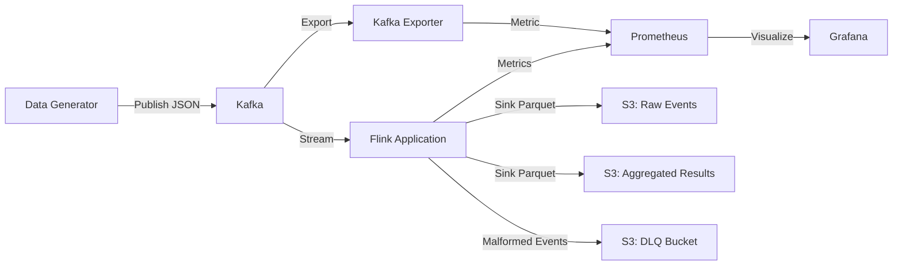

# Real-Time Pageview Data Pipeline

A real-time data pipeline for processing website pageview events using Kafka and Apache Flink, deployed locally via Docker and LocalStack (S3)

## Architecture



---

## Quick Start

### Prerequisites

- **Docker and Docker Compose**: To run Kafka, Flink, Data Generator, and **LocalStack** containers (no separate LocalStack installation required).
- **Terraform (>= 1.5)**: To provision S3 buckets in LocalStack.
- **Make**: To orchestrate the simplified workflow.
- **Python 3.12+ & Poetry** (Optional): Only required for local unit testing or running the generator outside Docker.
- **`aws-cli`** (Optional): For manual S3 and Kafka verification.

### One-Command Setup

Get the entire pipeline infrastructure flowing with a single command:

```bash
# Installs dependencies, starts Docker, provisions S3, and selects 'local' workspace
make infra-up
```

*Note: This starts the infrastructure (Kafka, Flink, S3) but the processing job must be submitted explicitly (see below).*

### Start Processing

Once the infrastructure is up, submit the PyFlink processing job:

```bash
# Submits the pipeline logic to the running cluster
make flink-submit-job PYFLINK_JOB=flink-app/src/main.py
```

### Validate Code Quality

Run all quality checks (lint, format, type-check, and tests) in one command:

```bash
# Proactively formats code and runs all tests via Nox
make all
```

### Components Running

Once `make infra-up` completes, we will have:

- **LocalStack**: S3 (Raw, Aggregated, & DLQ buckets), IAM.
- **Kafka**: Native Kafka (KRaft mode) + auto-created `pageview-events` topic.
- **Flink**: JobManager & TaskManager (v1.20).
- **Monitoring**: Prometheus (metrics) & Grafana (dashboards).

### 🔗 Service Endpoints

|Service|URL|Description|
|:---|:---|:---|
|**Grafana**|[http://localhost:3000](http://localhost:3000)|Visualization (User: `admin` / Pass: `admin`)|
|**Kafka Dashboard**|[http://localhost:3000/d/kafka-overview](http://localhost:3000/d/kafka-overview)|**Direct Link to Kafka Metrics**|
|**Flink Dashboard**|[http://localhost:8081](http://localhost:8081)|JobManager UI|
|**Prometheus**|[http://localhost:9090/targets](http://localhost:9090/targets)|Metrics Server|
|**Kafka Exporter**|[http://localhost:9308/metrics](http://localhost:9308/metrics)|Kafka Metrics|
|**LocalStack Health**|[http://localhost:4566/_localstack/health](http://localhost:4566/_localstack/health)|AWS Emulation Status|

### Generate Data

The data generator starts automatically as part of the container stack. To monitor the live event stream:

```bash
make generate
```

### Verify Pipeline

1. **Check S3 Buckets** (Provisioned via Terraform):

   ```bash
   AWS_ACCESS_KEY_ID=test AWS_SECRET_ACCESS_KEY=test AWS_DEFAULT_REGION=us-east-1 \
   aws --endpoint-url=http://localhost:4566 s3 ls
   ```

2. **Check Kafka Messages**:

   ```bash
   docker exec pageview-kafka kafka-console-consumer --bootstrap-server localhost:9092 --topic pageview-events --from-beginning --max-messages 5
   ```

3. **Check Flink Dashboard**: <http://localhost:8081> (Confirm your job is "RUNNING")

4. **Check Grafana**: <http://localhost:3000> (admin/admin)

---

### Components

- **Data Generator**: Python Kafka producer generating realistic pageview events (~1.16 events/sec for 100K/day) using a **Zipf distribution** for postcodes to simulate real-world data skew.
  > *Note: While the data contents are skewed (e.g., 'SW19' appears frequently), the producer currently uses round-robin partitioning (no key), so Kafka partitions remain balanced.*
- **Kafka**: Event streaming platform (KRaft mode) with 3 partitions for scalability.
- **Apache Flink**: Stream processing application for real-time aggregations and Parquet sink.
- **S3 Buckets**: Storage for raw events and aggregated results (Parquet format) via LocalStack.
- **Monitoring**: Prometheus + Grafana (+ Kafka Exporter) for metrics and visualization.
- **LocalStack**: Local AWS emulation specifically for S3 development and testing.

### Infrastructure Management

- **Provisioning**: **Terraform** manages all S3 buckets and IAM policies.
- **Workspaces**: Uses the `local` workspace for development (staging/production ready).
- **Data Lifecycle**:
  - **Raw Events**: Transition to Glacier after **30 days**.
  - **Aggregated Results**: Transition to Glacier after **30 days**.

---

## Quality Assurance

We use **Nox** to automate all code quality checks.

> [!NOTE]
> **Why Nox?**
>
> - **Isolation**: Every check (lint, test, etc.) runs in a fresh virtualenv, preventing local dependency pollution.
> - **Single Source of Truth**: Dynamically pulls Python versions and dependencies from `pyproject.toml`.
> - **Reproducibility**: Guarantees that local checks and CI/CD runs are identical.
> - **Automation**: Proactively fixes formatting and import sorting while verifying type safety.

### Run All Checks

```bash
# Runs Lint, Format, Type Check, Test, and Coverage in order
make all
```

### Individual Checks

|Command|Tool|Description|
|:---|:---|:---|
|`make lint`|**Ruff**|Catch errors and automatically fix safe violations (like import sorting)|
|`make format`|**Ruff**|Automatically reformat code to match project standards|
|`make type-check`|**ty**|Verify type safety across the entire codebase|
|`make test`|**pytest**|Run unit and integration tests|

---

## Common Operations (Cheat Sheet)

### Service Management via Makefile

|Command|Description|
|:---|:---|
|`make infra-up`|Start Docker & Provision Terraform (Full Start)|
|`make infra-down`|Destroy Terraform resources & Stop Docker|
|`make docker-up`|Start Docker containers only|
|`make docker-down`|Stop Docker containers only|
|`make generate`|Run data generator|
|`make monitor`|Open Grafana|
|`make all`|Run all Python Quality Checks (Nox)|
|`make list-s3`|List S3 buckets in LocalStack|
|`make list-s3-raw`|List objects in raw events bucket|
|`make list-s3-dlq`|List objects in DLQ bucket|
|`make list-s3-aggregated`|List objects in aggregated bucket|

### Kafka Operations

```bash
# List topics
make kafka-list-topics
# or: docker exec pageview-kafka kafka-topics --bootstrap-server localhost:9092 --list

# Consume messages
make kafka-consume-events
# or: docker exec pageview-kafka kafka-console-consumer --bootstrap-server localhost:9092 --topic pageview-events
# Note: Uses an isolated consumer group; does not affect Flink offsets.
```

### Flink Operations

```bash
# List jobs
make flink-list-jobs
# or: docker exec pageview-flink-jobmanager flink list

# Submit PyFlink job
make flink-submit-job PYFLINK_JOB=flink-app/src/main.py
# or: docker exec pageview-flink-jobmanager flink run -py /opt/project/flink-app/src/main.py

# Cancel job
make flink-cancel-job id=<JOB_ID>
# or: docker exec pageview-flink-jobmanager flink cancel <JOB_ID>
```

### S3 Operations (LocalStack)

```bash
# List buckets
make list-s3
# or: AWS_ACCESS_KEY_ID=test AWS_SECRET_ACCESS_KEY=test AWS_DEFAULT_REGION=us-east-1 \
#     aws --endpoint-url=http://localhost:4566 s3 ls

# List objects in raw events bucket
make list-s3-raw
# or: AWS_ACCESS_KEY_ID=test AWS_SECRET_ACCESS_KEY=test AWS_DEFAULT_REGION=us-east-1 \
#     aws --endpoint-url=http://localhost:4566 s3 ls s3://pageview-pipeline-local-raw-events/

# List objects in DLQ bucket (malformed events)
make list-s3-dlq
# or: AWS_ACCESS_KEY_ID=test AWS_SECRET_ACCESS_KEY=test AWS_DEFAULT_REGION=us-east-1 \
#     aws --endpoint-url=http://localhost:4566 s3 ls s3://pageview-pipeline-local-dlq/

# List objects in aggregated bucket
make list-s3-aggregated
# or: AWS_ACCESS_KEY_ID=test AWS_SECRET_ACCESS_KEY=test AWS_DEFAULT_REGION=us-east-1 \
#     aws --endpoint-url=http://localhost:4566 s3 ls s3://pageview-pipeline-local-aggregated/
```

---

## Configuration

All configuration is managed via environment variables (see `.env.example`).

## Scalability

### Current Capacity

- **Throughput**: ~100K events/day (1.16 events/sec)
- **Brokers**: 1 Kafka broker (simulating 3-node cluster)
- **Partitions**: 3 partitions per topic
- **Flink Parallelism**: 2

### Scaling to 1M+ events/day

1. **Horizontal scaling**: Increase Kafka partitions and Flink parallelism
2. **Vertical scaling**: Increase broker and Flink instance sizes
3. **State backend tuning**: Configure RocksDB for larger state
4. **Partitioning strategy**: Partition by postcode for better distribution

## Troubleshooting

### LocalStack not starting

```bash
# Check Docker daemon
docker ps

# View LocalStack logs
docker-compose logs localstack

# Restart LocalStack
docker-compose restart localstack
```

### Kafka connection errors

```bash
# Verify Kafka container is running
docker ps | grep kafka

# Check broker logs
docker logs pageview-kafka
```

### Data generator not publishing

```bash
# Check generator logs
docker-compose logs data-generator

# Verify Kafka topic exists
docker exec -it pageview-kafka kafka-topics --list --bootstrap-server localhost:9092
```
